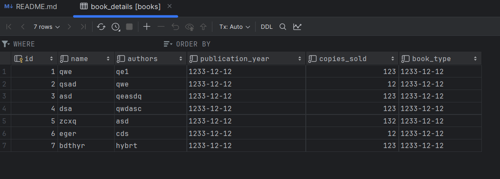

<h1>Working with SQL Database in Java</h1>

This project demonstrates how to connect and work with an SQL database in Java. In this example, MySQL is used, but the approach is applicable to other SQL databases as well.

<h2>Steps to Work with Database</h2>

<h3>1. Add Dependency for MySQL Connector</h3>

For Java to interact with an SQL database, you need to add the MySQL connector dependency in your `pom.xml` (if you're using Maven):

<h3>2. Set Up Database Connection</h3>

Create a class to manage the connection to the database:

<h3>4. Closing the Connection</h3>

Make sure to close the database connection to avoid memory leaks. This can be done using `try-with-resources`, as shown in the example above.

<h3>5. Handling Exceptions</h3>

Always handle SQL exceptions with a `try-catch` block to capture any errors during connection or query execution.

<h2>Conclusion</h2>

This is a basic example of working with a database in Java. You can use `PreparedStatement` to prevent SQL injection and work with transactions for more complex database operations.

</body>
