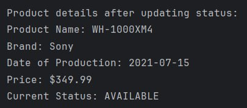

---

Tasks Overview
1. Working with Records (Books)
   Objective: Create a Book record to store book details and filter books published between user-provided years.
   Key Features:
   Implements Java record for concise data representation.
   Uses ArrayList to store multiple books.
   Filters books based on a publication year range entered by the user.
   How to Run: Select Option 1 in the menu and enter the desired year range.
2. Working with Enums (Headphones)
   Objective: Manage headphone products using the ProductStatus enum and update their availability status.
   Key Features:
   ProductStatus enum defines multiple statuses (e.g., AVAILABLE, UNAVAILABLE).
   Headphones class represents product details and allows status updates.
   Modifies and displays the status of the last product.
   How to Run: Select Option 2 in the menu to view and update headphone product statuses.
3. Database Operations (Students)
   Objective: Create a student database, perform updates, and delete records based on specific IDs.
   Key Features:
   Uses SQLite to manage a students.db database.
   Implements StudentDatabase class for CRUD operations.
   Prompts user to input, update, and delete student records.
   How to Run:
   Ensure the SQLite driver is set up in the project.
   Select Option 3 in the menu.
   Follow the console instructions to input, update, and delete student data.